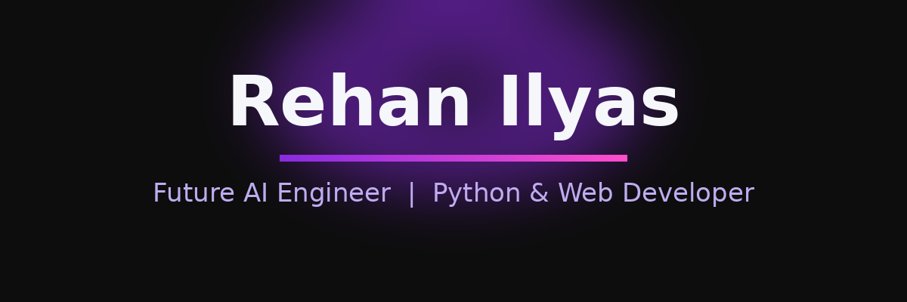

  

I'm **Rehan Ilyas**, a Computer Science student at UET Lahore, Pakistan, on a mission to become an **AI Engineer**. I love building things with Python, exploring AI concepts, and turning ideas into real projects.

**About Me**

- CS undergraduate at UET Lahore, Pakistan
- Currently diving deep into **Python & AI**
- Beginner in **Data Structures and Algorithms**
- Building AI news & automation workflows as a side project
- Ask me about anything [here](https://github.com/RehanIlyas-dev/RehanIlyas-dev/issues)
- Reach me at [rehanilyas4726@gmail.com](mailto:rehanilyas4726@gmail.com)
- [My Portfolio](https://rehan-ilyas.vercel.app/)

---

## Things I Code With

  
  
  
  
  
  
  
  
  
  
  
  
  
  
  
  
  
  

---

## GitHub Stats

---

## Featured Projects

<table>
  <thead>
    <tr>
      <td><b>Project</b></td>
      <td><b>Stars</b></td>
      <td><b>Forks</b></td>
      <td><b>Issues</b></td>
    </tr>
  </thead>
  <tbody>
    <tr>
      <td><a href="https://github.com/RehanIlyas-dev/JARVIS"><b>JARVIS</b></a> - Smart Python virtual assistant with voice-powered AI</td>
      <td></td>
      <td></td>
      <td></td>
    </tr>
    <tr>
      <td><a href="https://github.com/RehanIlyas-dev/insta-daemon"><b>insta-daemon</b></a> - 24/7 Instagram comment-to-DM automation via GitHub Actions</td>
      <td></td>
      <td></td>
      <td></td>
    </tr>
    <tr>
      <td><a href="https://github.com/RehanIlyas-dev/DevMetrix-API"><b>DevMetrix-API</b></a> - Developer market analytics with FastAPI + Streamlit</td>
      <td></td>
      <td></td>
      <td></td>
    </tr>
    <tr>
      <td><a href="https://github.com/RehanIlyas-dev/ApexTrace"><b>ApexTrace</b></a> - F1 telemetry & spatial alignment analytics engine</td>
      <td></td>
      <td></td>
      <td></td>
    </tr>
    <tr>
      <td><a href="https://github.com/RehanIlyas-dev/DSA"><b>DSA</b></a> - LeetCode solutions to ace the coding interview</td>
      <td></td>
      <td></td>
      <td></td>
    </tr>
    <tr>
      <td><a href="https://github.com/RehanIlyas-dev/VisaVault"><b>VisaVault</b></a> - Visa & immigration workflow automation (C# + MySQL)</td>
      <td></td>
      <td></td>
      <td></td>
    </tr>
  </tbody>
</table>

---

## Find Me Around the Web

  
  
  
  

---

<i>This profile was built with Python, PIL, and GitHub's plain Markdown.</i>
