  

  

---

Hey there! I'm **Rehan**, a developer from Pakistan on a mission to become an **AI Engineer**. I love building things with Python, exploring AI concepts, and turning ideas into real projects.

- Currently diving deep into **Python & AI**
- The beginner in **Data Structures and Algorithms**
- [My Portfolio](https://rehan-ilyas.vercel.app/)
- [rehanilyas4726@gmail.com](mailto:rehanilyas4726@gmail.com)

---
## Tech Stack

**Languages**

  

**Frontend**

  

**Data Science & AI**

  

**Database & Tools**

  

---

## GitHub Stats

---

---

  

